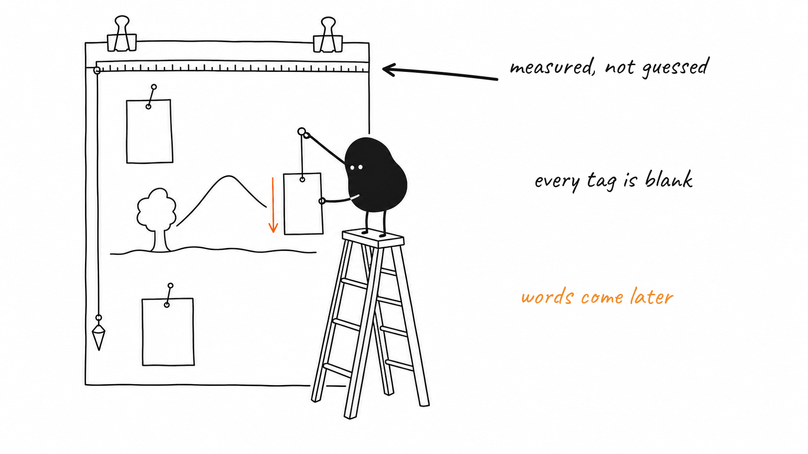

# show-me-how

[](LICENSE)
[](package.json)
[](https://code.claude.com/docs/en/plugins)
[](test)
[](skills/illustrate/references/backends.md)

Explain code, features and PRs with mascot-illustrated plain-language docs. Hand-drawn style, your brand, your font.

A Claude Code plugin. Point it at a feature, a folder, or a topic; it reads the code, picks the 2-5 beats worth a panel, has a mascot act them out in hand-drawn style, and writes a short storybook with the panels in sequence. Works with your ChatGPT subscription (via the Codex CLI) or with any image tool by hand.



## Install

```
/plugin marketplace add ShahriarBijoy/show-me-how
/plugin install show-me-how@show-me-how
```

The first run installs `sharp` into the plugin folder automatically. Requires Node >=20.9.

From a clone instead (useful while hacking on the plugin):

```bash
git clone https://github.com/ShahriarBijoy/show-me-how.git
cd show-me-how && npm install
claude --plugin-dir .
```

## Commands

| Command | Does | Example |
|---|---|---|
| `/show-me-how:init` | Sets up `design.md` (mascot, font, colors, tone, output folder) and draws one test image. | `/show-me-how:init` |
| `/show-me-how:explain <topic>` | Explains a feature or concept as a 1-3 panel storybook, shown in chat and saved. | `/show-me-how:explain label overlay` |
| `/show-me-how:write-doc [path\|folder\|topic]` | Writes a storybook doc as `docs/show-me-how/<topic>/<topic>.md` (set `docs:` in design.md to move it). | `/show-me-how:write-doc scripts/` |
| `/show-me-how:pr-review [pr\|url]` | Draws "the picture of what this PR does" — never posts or commits. | `/show-me-how:pr-review 412` |

## Backends

v1 tries, in order: `codex` CLI (ChatGPT subscription, auto-detected on PATH), then falls back to manual — a prompt file is written for you to paste into ChatGPT/Gemini and save back.

Pin one instead of auto-detecting by setting `backend:` in `design.md` (`auto`, `codex`, or `manual`); `codex_model:` and `codex_reasoning:` in the same section tune which codex model runs the job and how hard it thinks (default: codex's own model at `low` effort).

If you have `openai/codex-plugin-cc` installed, `/codex:rescue` can run the same prompt; it's not required.

## Brand

`design.md` at your repo root controls the look: mascot, font, colors, tone, output folder. Run `/show-me-how:init` to create it.

- Mascot: Flow (default) — small solid-black blob, deadpan — or bring your own: a text description plus 1-3 reference images.
- Font for labels: Caveat (bundled, OFL), or a local `.ttf`/`.otf` path.
- Colors, tone, and the docs output folder are also editable fields.

## How it works

1. Understand: read the topic's source files or commits, write a short brief.
2. Beats: pick 2-5 panels that tell it in order — setup, action, twist, payoff.
3. Panel list: print the planned panels and captions before drawing.
4. Draw: generate every panel at once, in parallel, with no text baked in.
5. Label + write: overlay labels in your brand font, then write one storybook — `docs/show-me-how/<topic>/<topic>.md` with `01.png`, `02.png`… inline. Working files live in `.show-me-how/` and are removed when the run completes.

v1.1 roadmap: `gemini` and API-key backends, Google Font downloads, and in-image labels.

## Credits

The illustration method (cognitive anchors, shot lists, the "mascot performs the action" rule, style DNA, composition patterns, QA checklist) is adapted from **Ian Xiaohei Illustrations** by Ian (伊恩): https://github.com/helloianneo/ian-xiaohei-illustrations (MIT). Flow, the default mascot, is original to show-me-how.

MIT licensed. See [NOTICE.md](NOTICE.md) for full attribution.
