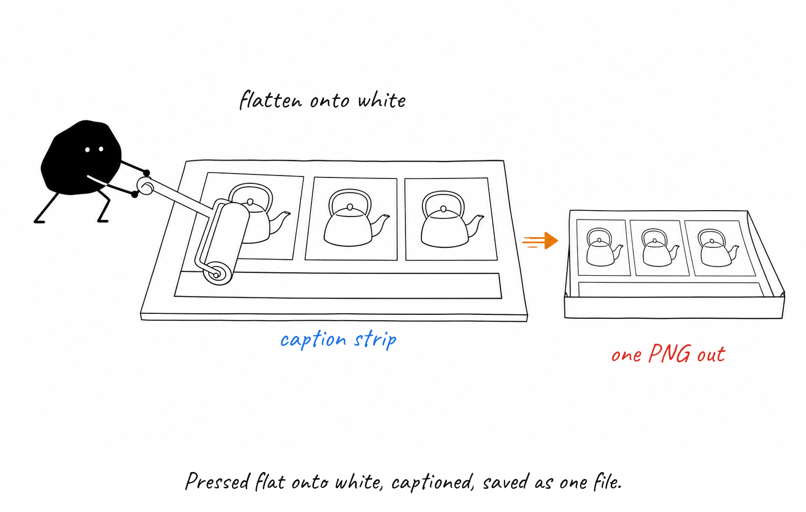

# How labels land on a finished picture

Every panel is drawn twice: once as wordless line art by the image backend, once
more when `scripts/label.mjs` puts the words on.

### The picture arrives with no words on it.

The image backend is told to draw line art only — no letters, no numbers — and
to leave empty space beside each key object. That space is where a label will go.

### Each label lands where its fractions say.

`label.mjs` reads a small JSON file: the label text, `x` and `y` as fractions of
the canvas, and a `kind` (black, flow, warn, note) that picks its colour.

### The usual font route is locked, so the file goes in by the side door.

SVG text cannot reach the brand font through fontconfig on Windows, so each label
is rendered by libvips' text operation with the `.ttf` loaded directly.

### Pressed flat onto white, captioned, saved as one file.

The composite is flattened onto white (backends return transparent PNGs more often
than you'd think), a caption strip is added below in the same font, and only the
finished PNG is written.

**Remember:** coordinates are fractions of the canvas, not pixels — 0.5 is the middle whatever the image size.

Sources

- scripts/label.mjs
- scripts/lib/design.mjs
- skills/illustrate/SKILL.md
- test/label.test.mjs

