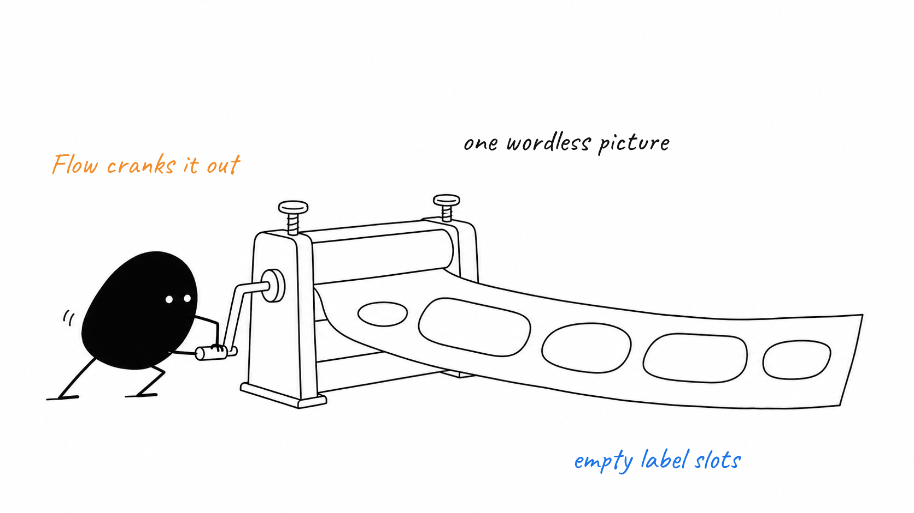
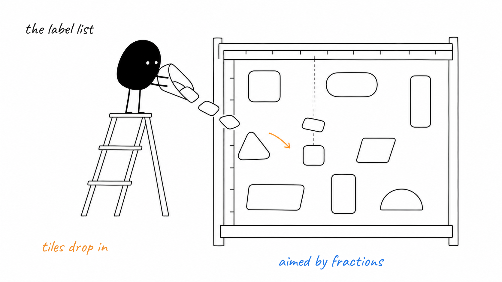
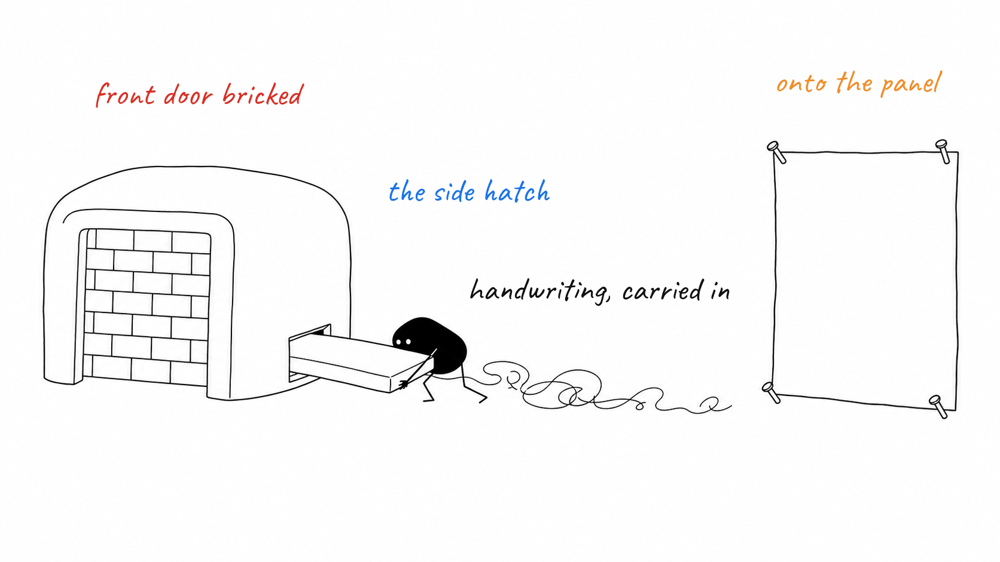

# How labels land on a finished picture

Every panel in this repo is drawn twice: once as pure line art, once again when
the words go on.

The image backend returns line art and nothing else — no letters, no numbers.
Where a word belongs, the prompt asks for empty space instead.

`scripts/label.mjs` takes the raw PNG and a small JSON file. Each label carries
x and y as fractions of the canvas, plus a kind that picks its colour.

The font cannot be reached through the usual SVG route, so the file is loaded
directly by libvips and the result is flattened onto white.

**Remember:** coordinates are fractions of the canvas, not pixels — 0.5 is the middle whatever the image size.

Sources

- README.md
- scripts/label.mjs
- scripts/lib/design.mjs
- skills/illustrate/SKILL.md
- test/label.test.mjs

