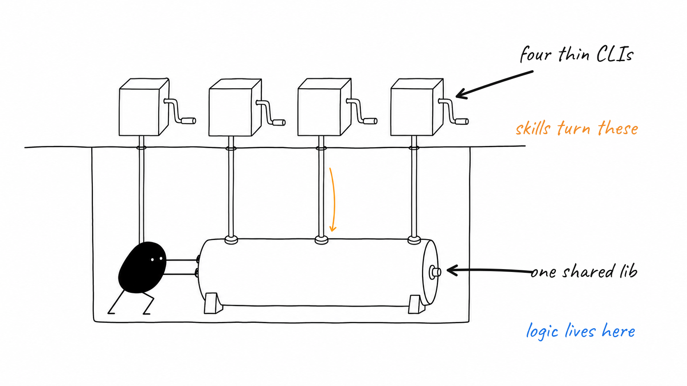
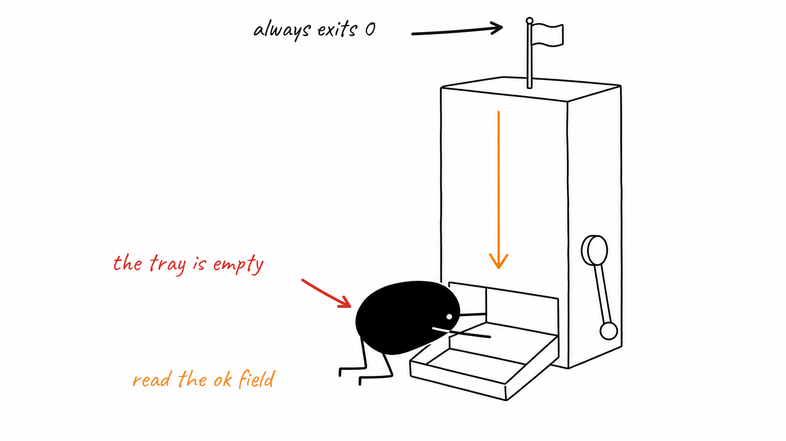
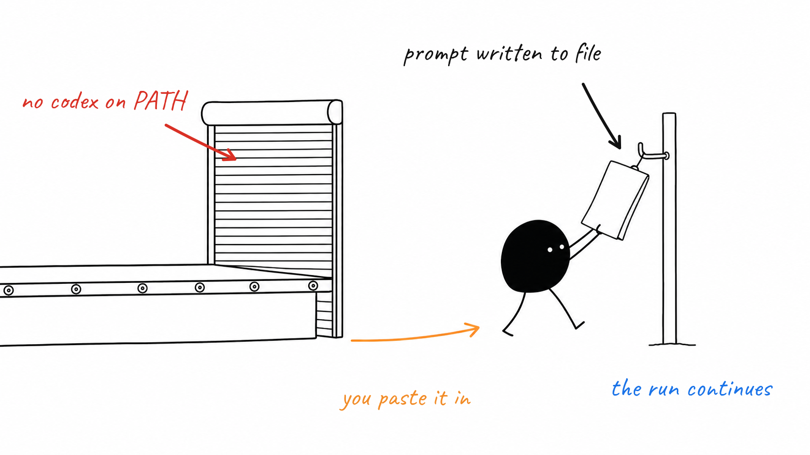

# scripts/

`scripts/` is the whole executable surface of show-me-how: four small command-line entry points that the skills shell out to, plus a `lib/` folder where the actual logic lives so the tests can import it directly instead of spawning processes. `design.mjs` resolves the repo's brand, `slug.mjs` turns a topic into a folder name, `backend.mjs` picks and drives an image backend, and `label.mjs` writes the labels onto the finished picture. Nothing else in the plugin runs code.

## Four handles, one shared drum

Each of the four `.mjs` files at the top of `scripts/` is a few lines long: parse argv, call into `scripts/lib/`, print. That split is deliberate. The skills only ever touch the CLIs, so the calling contract stays a stable shell command, while `test/` imports the functions from `lib/` and asserts on real return values. Change behaviour in `lib/`; change the command line in the CLI.

## The machine always says fine

`backend.mjs generate` always exits 0. Success lives in the JSON `ok` field, never in the exit code — even a bad `design.md` (unknown backend, an unsupported `codex_reasoning`) comes back as `{"ok":false, ...}` with the reason in `stderr` rather than a stack trace. That is a promise the skills rely on: one bad shot must not abort a six-image run. `detect` is the exception and still throws loudly, because a mis-pinned backend should stop the run before any images are made.

## Shutter down, job handed over

If `codex` is not on PATH, detection falls back to the `manual` backend. `generate` then writes the full prompt to `<out>.prompt.txt` and returns `ok:false` with a `promptFile` — the run keeps going, and you paste the prompt into ChatGPT or Gemini yourself, save the PNG at the path it names, and re-run the same command to pick it up and label it. No backend means slower, never broken.

## The Windows details

Three of them, all inside `lib/backends.mjs`, all found the hard way. `codex` is a `.cmd` shim, so Node cannot spawn it without a shell, but Node's own `shell:true` quoting does not escape cmd.exe metacharacters — the command line is therefore built and caret-escaped by hand and passed with `windowsVerbatimArguments`. The child's stdin must be `'ignore'`: `codex exec` blocks reading an open stdin pipe forever, a silent zero-CPU hang. And cmd.exe truncates any argument at the first newline, so prompt newlines are flattened to spaces before they are ever passed.

## Sources
- scripts/design.mjs
- scripts/slug.mjs
- scripts/backend.mjs
- scripts/label.mjs
- scripts/lib/design.mjs
- scripts/lib/slug.mjs
- scripts/lib/backends.mjs
