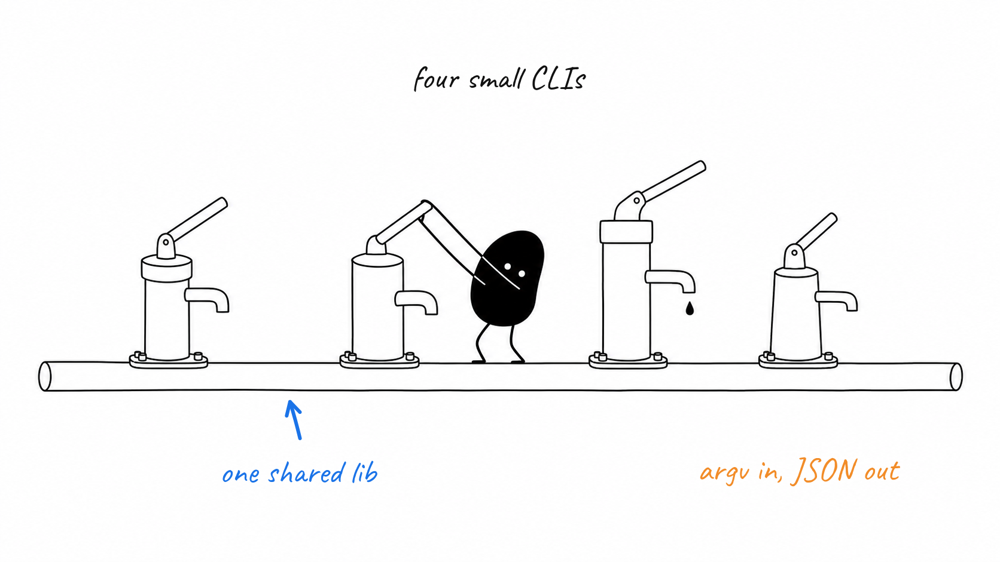
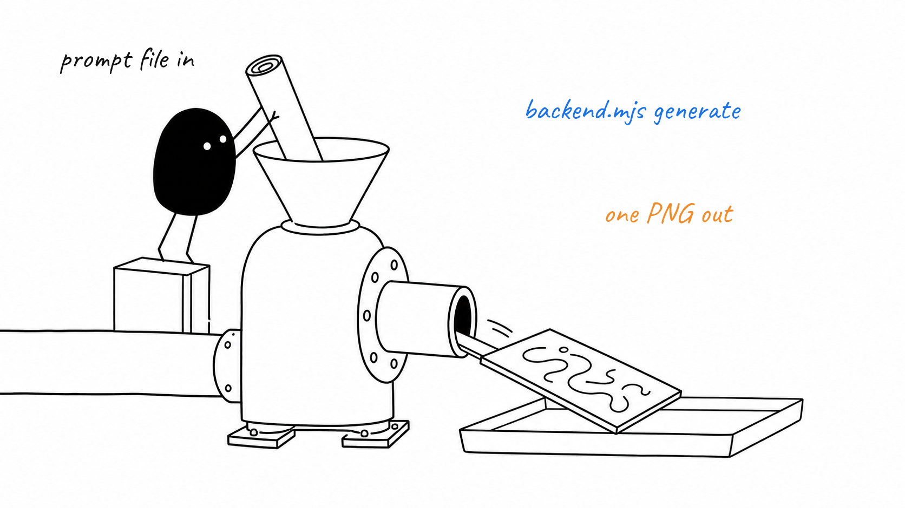
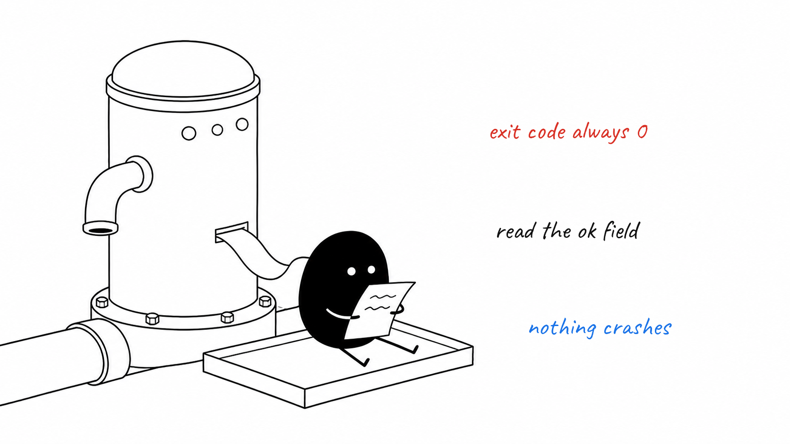

# The four little CLIs under the skills

The skills are prose; `scripts/` is the part that actually runs. Four tiny
commands, one shared library underneath.

`design.mjs`, `slug.mjs`, `backend.mjs` and `label.mjs` are thin argv wrappers.
The logic lives in `scripts/lib/`, which the tests import directly instead of
shelling out.

`backend.mjs generate` takes a prompt file and a few reference images, hands
them to codex, and writes exactly one PNG where you asked for it.

When a drawing fails, nothing throws. The command still exits 0 and prints a
JSON slip; the `ok` field is the only real answer.

**Remember:** never read success from the exit code of `backend.mjs generate` — read `ok` in the JSON it prints.

Sources

- scripts/backend.mjs
- scripts/design.mjs
- scripts/label.mjs
- scripts/slug.mjs
- scripts/lib/backends.mjs
- scripts/lib/design.mjs
- scripts/lib/slug.mjs

