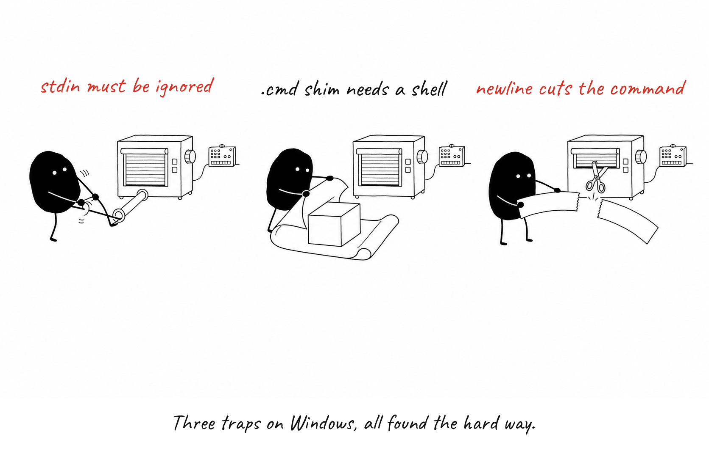
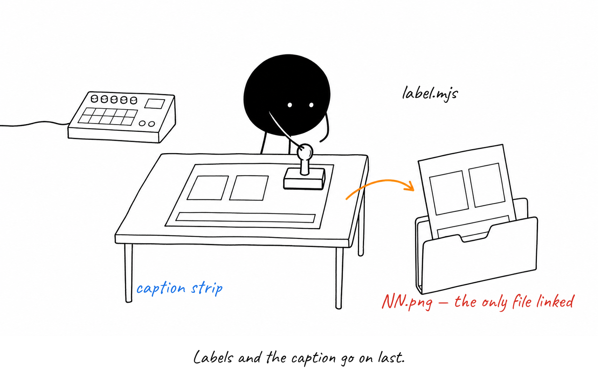

# scripts/ — the plugin's four handles

`scripts/` is the only code in show-me-how: four tiny command-line entry points
that the skills call, and a `lib/` folder where the real logic lives.

### Four thin handles, one machine inside.

Each CLI — `design`, `slug`, `backend`, `label` — is a few lines: parse argv, call
into `scripts/lib/`, print. Skills only touch the CLIs; tests import `lib/` directly.

### It never crashes; it hands you a ticket.

`backend.mjs generate` always exits 0. Success lives in the JSON `ok` field, so one
bad panel can never abort a whole run — the skill reads the ticket and moves on.

### No backend? The prompt goes under the shutter.

Without `codex` on PATH, the manual backend writes the full prompt to a file for
you to paste into ChatGPT or Gemini. Save the image where it says and re-run; the
saved panel is picked up.

### Three traps on Windows, all found the hard way.

`codex` is a `.cmd` shim that needs a shell, an open stdin pipe hangs it forever,
and cmd.exe cuts the command at the first newline — so the command line is built
and escaped by hand.

### Labels and the caption go on last.

`label.mjs` overlays the labels and a caption strip in the brand font and writes
the one PNG the doc links to. Everything before it is scratch.

**Remember:** change behaviour in `scripts/lib/`; change the command line in the CLI.

Sources

- scripts/design.mjs
- scripts/slug.mjs
- scripts/backend.mjs
- scripts/label.mjs
- scripts/lib/design.mjs
- scripts/lib/slug.mjs
- scripts/lib/backends.mjs

